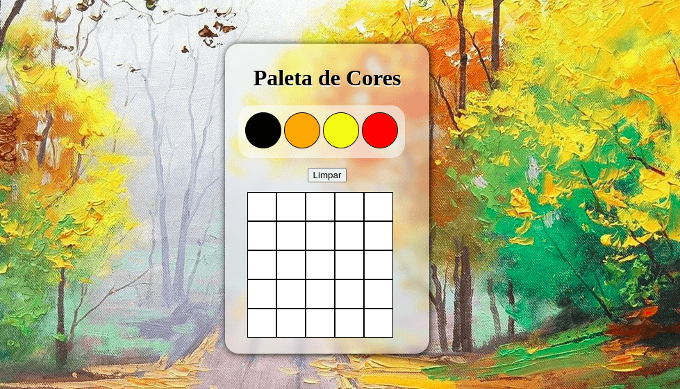

# Pixels Art

Projeto feito utilizando HTML, CSS e Javascript em 08 de julho de 2021 durante o curso da Trybe.

## ⭐ Habilidades

- Treinar as habilidades de programação com Javascript, HTML e CSS.

## 🔧 Funçoes

- Poder criar desenhos feitos com pixels
- Escolher cores e poder limpar todo o quadro

## 💻 Como iniciar

1. Faça o clone do projeto
2. Entre no Visual Studio Code
3. Inicialize o projeto utilizando a extensão "Live Server"

## Feito Com:

### Contato

Copyright © 2021 Michael Caxias

